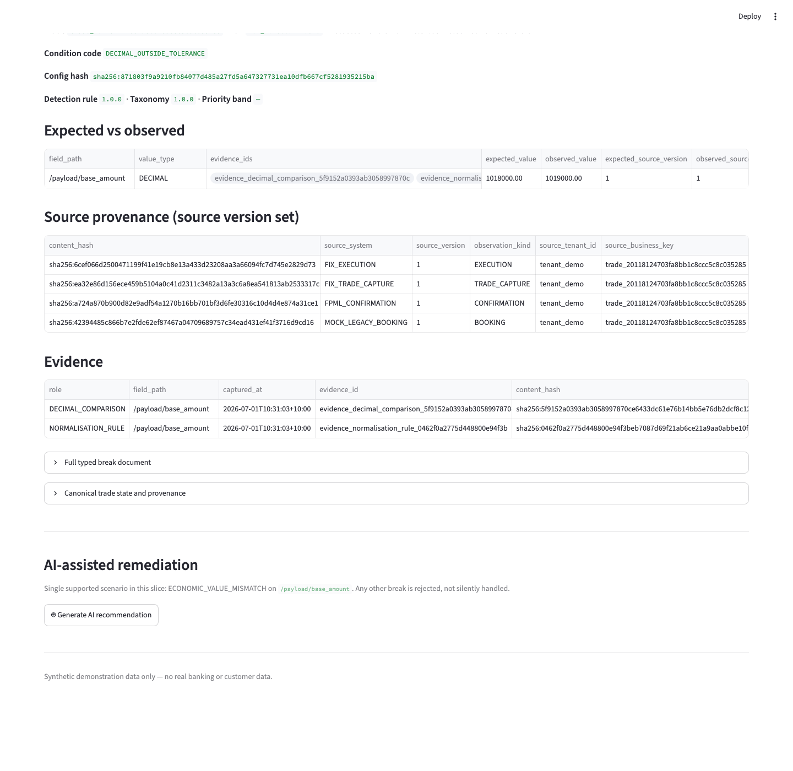
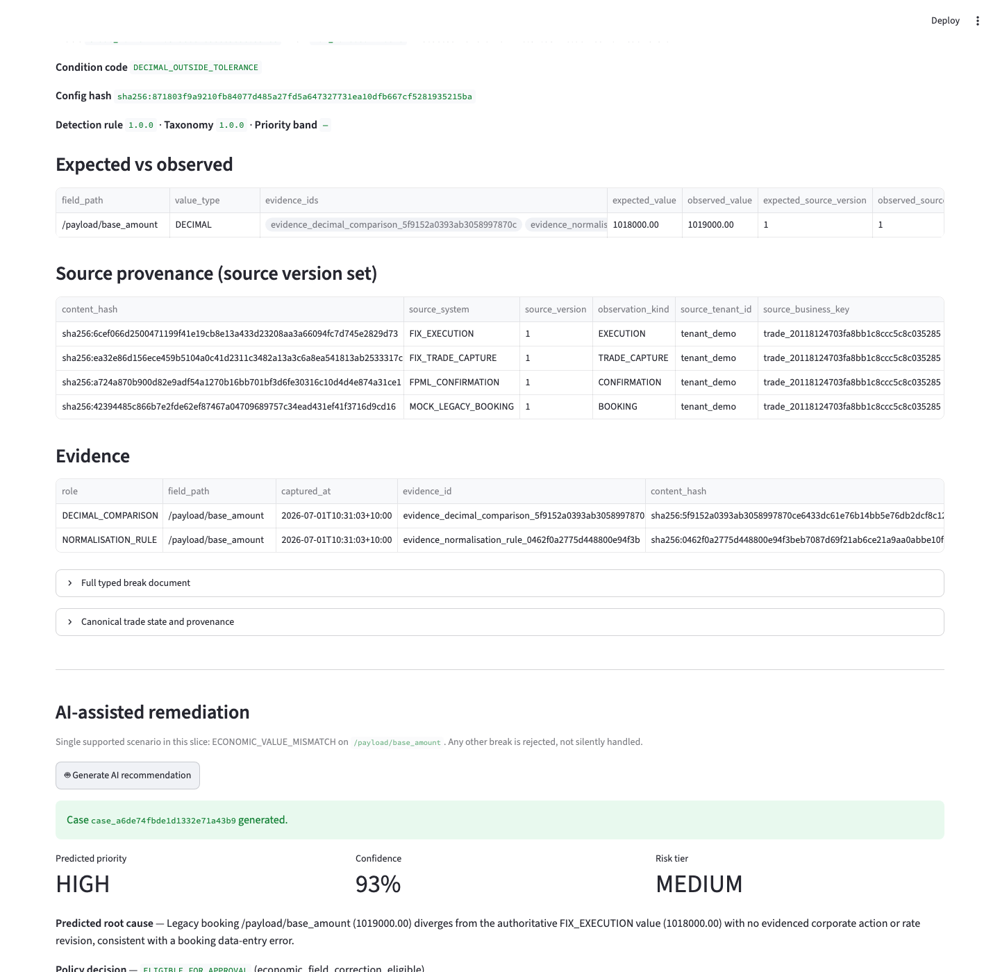
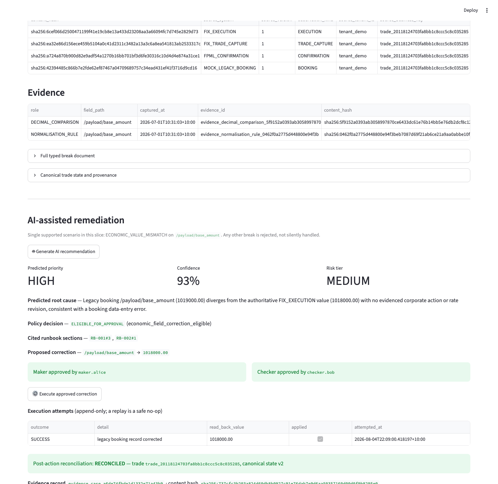

# Controlled-AI remediation slice

One small, complete, visible controlled-AI remediation workflow layered on
top of the existing deterministic FX reconciliation MVP. It demonstrates
end-to-end, for exactly one break family and one field, how an AI-generated
recommendation can lead to a real, auditable correction without the AI ever
touching a system directly.

**This is not an autonomous remediation platform.** It supports exactly one
scenario. Extending it to other break families, fields, or products is
explicitly out of scope for this slice — see [Scope](#scope) below.

## The one supported scenario

`ECONOMIC_VALUE_MISMATCH` on `/payload/base_amount`, where the legacy
booking system (`MOCK_LEGACY_BOOKING`) disagrees with the authoritative
execution value (`FIX_EXECUTION`). Nothing else — a different break family, a
different field, or a value the AI proposes that doesn't match the
reconciliation engine's own authoritative source is rejected, not
generalised to.

## Workflow

1. The existing deterministic reconciliation engine detects the break
   (unchanged — `packages/reconciliation`).
2. `packages/remediation/triage.py` builds a strict `BreakFacts` document
   from the break's own structured comparison data — no raw source documents,
   no database access from the AI's side.
3. The versioned local LightGBM model scores queue priority from those same
   point-in-time facts and returns complete SHAP contribution evidence. It is
   advisory and cannot affect policy or authorise an action; see
   [`ML_PRIORITY_MODEL.md`](ML_PRIORITY_MODEL.md).
4. An AI provider (`packages/remediation/ai_provider.py`) returns a strict
   `AIRecommendation`: predicted root cause, confidence, priority,
   recommended action, proposed field/value, risk tier, citations, or an
   abstain reason. The LLM never executes SQL, calls a tool, or modifies
   anything — it returns one JSON document, validated against the schema
   before anything downstream sees it.
5. The recommendation must cite a real runbook section
   (`packages/remediation/retrieval.py`, `packages/remediation/runbooks/`).
6. `packages/remediation/policy.py`, a deterministic engine, evaluates the
   recommendation against a fixed rule set. It never trusts the AI's own
   `required_approvals` or `risk_tier` — those are advisory; the policy
   engine's own decision is authoritative.
7. If eligible, a Maker and a different-identity Checker approve
   (`POST /remediation/cases/{id}/maker-approval` /
   `.../checker-approval`).
8. A signed, expiring, idempotent `ActionEnvelope` is built and issued once
   per case (`packages/remediation/envelope.py`).
9. `RemediationExecutor` (`packages/remediation/executor.py`) verifies the
   envelope and approvals, then calls `MockLegacyBookingAdapter` to apply
   the one approved field.
10. The corrected value is read back, then re-delivered into the normal
   observation-ingestion pipeline as a new, superseding `BOOKING`
   observation (`apps/api/service.py::ingest_corrected_booking_observation`)
   — this is what makes the correction visible to reconciliation at all; see
   [Why a new observation, not a canonical-state patch](#why-a-new-observation-not-a-canonical-state-patch).
11. The existing deterministic reconciliation pipeline reruns, scoped to
    just this trade (`apps/api/service.py::rerun_trade_reconciliation`), and
    confirms the break is resolved.
12. A frozen, hashed evidence record is written, preserving the original
    break, the LightGBM/SHAP assessment, the AI recommendation, citations, confidence, the policy
    decision, both approvals, the envelope's content hash, every execution
    attempt, and the post-action reconciliation result
    (`packages/remediation/evidence.py`).

## AI provider

Three providers implement the same narrow `AIProvider` contract in
`packages/remediation/ai_provider.py`:

- `DeterministicTestProvider` remains the default and is used throughout CI.
  It is a rule-based test double, not a model. It supports exactly the one
  scenario above and abstains elsewhere.
- `AzureOpenAIProvider` uses Azure OpenAI structured outputs. It sends only
  `BreakFacts` plus retrieved synthetic runbook sections, requires every
  output field in a strict transport schema, immediately converts the result
  to `AIRecommendation`, caps completion output at 400 tokens, and defaults
  reasoning effort to `minimal`. The transport represents proposed fields as a
  bounded list because Azure Structured Outputs does not accept dynamic-key
  maps; the deterministic policy still receives the unchanged dictionary
  contract. It authenticates with the
  current Microsoft Entra identity by default (`DefaultAzureCredential`), or
  with `AZURE_OPENAI_API_KEY` when explicitly supplied. Credentials are never
  persisted or printed by this repository.
- `AnthropicProvider` uses the `anthropic` Python SDK against
  `claude-sonnet-5` by default. Its adapter is implemented, but it has not been
  exercised against a live Anthropic API call and no such claim is made.

Select a provider with `TRADEOPS_AI_PROVIDER=deterministic`,
`azure-openai`, or `anthropic`. Unknown names fail closed. Azure configuration
is supplied through `AZURE_OPENAI_ENDPOINT`, `AZURE_OPENAI_DEPLOYMENT`,
`AZURE_OPENAI_API_VERSION`, `AZURE_OPENAI_MAX_COMPLETION_TOKENS`, and
`AZURE_OPENAI_REASONING_EFFORT`; see `.env.example`.

For a bounded live Azure check, run
`scripts/run_azure_recommendation_demo.py`. The script sends one synthetic
break, validates the strict response, and passes it through the same
deterministic policy engine. It does not open a database connection, issue an
action envelope, request approval, or execute a correction. The live provider
is advisory only; all authorization and execution boundaries below remain
unchanged. This path was exercised successfully against the deployed
`gpt-5.4-mini` model on 2026-08-07; the sanitized result and exact claim
boundary are recorded in `docs/AZURE_OPENAI_VALIDATION.md`.

## Runbook retrieval

Three short synthetic documents (`packages/remediation/runbooks/`):

- `RB-001` — FX economic-value mismatch correction procedure
- `RB-002` — Maker-checker approval policy
- `RB-003` — Automation failure and recovery procedure

Retrieval is local keyword-overlap search over the parsed section index
(`packages/remediation/retrieval.py::search`) — no vector database, no RAG
platform. Search relevance alone is never trusted: the actual fail-closed
gate is `citation_supports_action`, a small hardcoded allowlist of which
runbook sections can back which action. A citation that resolves to a real
document/section but isn't on that allowlist is rejected identically to a
missing one.

## Policy and approval rules

Implemented in `packages/remediation/policy.py` and
`packages/remediation/executor.py`, in this order:

1. Confidence below `0.7` → `MANUAL_INVESTIGATION`, before anything else is
   even inspected.
2. The AI abstaining (`recommended_action: null`) → `MANUAL_INVESTIGATION`.
3. Any action outside the closed allow-list
   (`{"CORRECT_LEGACY_BOOKING_FIELD"}`) → `REJECTED`. Order
   submit/cancel/amend, price decisions, and trading actions cannot even be
   expressed by the `AIRecommendation` schema's `RecommendedAction` Literal.
4. Missing citation → `REJECTED`.
5. Citation present but not on the action's support allowlist → `REJECTED`.
6. Proposed field outside `ALLOWED_PROPOSED_FIELDS`
   (`{"/payload/base_amount"}`), not matching the break's own field, or a
   value that doesn't exactly equal the reconciliation engine's own
   authoritative value → `REJECTED`. The AI's restated number is never
   trusted; it must reproduce what the engine already established.
7. Economic-field correction, eligible → `required_approvals: ["MAKER",
   "CHECKER"]`, hardcoded — independent of whatever the AI itself claimed.
8. Maker and Checker must be different identities — enforced at approval
   submission (API layer) and again at execution (`RemediationExecutor`,
   bound to the identities recorded on the signed envelope).
9. The AI cannot approve its own recommendation — there is no
   AI-driven approval path; `MAKER`/`CHECKER` decisions only ever come from
   the two approval endpoints, each requiring a human-supplied identity.
10. Only the exact approved field and value may change — enforced by the
    envelope's `field_path`/`approved_value`, checked against the allow-list
    again at execution time, independent of the policy decision that built it.

## Signed action envelope

`ActionEnvelope` (`packages/remediation/models.py`) carries: `case_id`,
`trade_id`, `action_type`, the exact approved field path and value, the
expected old value, maker/checker identity, `issued_at`/`expires_at`,
`idempotency_key`, `content_hash`, and `signature`.

Signing uses HMAC-SHA256 over a canonical JSON serialisation of every field
except the hash and signature themselves
(`packages/remediation/envelope.py::build_envelope` /
`verify_envelope`), keyed by a **local secret read from the
`TRADEOPS_REMEDIATION_SIGNING_SECRET` environment variable. This secret is
never committed anywhere in this repository.**

The executor rejects, in order: an expired envelope, a tampered envelope
(content or signature mismatch — checked before expiry, so a
modified-and-expired envelope is reported as tampered), missing or
incomplete approvals, same-identity Maker/Checker, a field outside the
approved allow-list, and — delegated to the mock adapter's row-locked
check — an unexpected current value or a replay that would create a second
side effect.

## Mock legacy execution and attended UiPath boundary

`MockLegacyBookingAdapter` (`packages/remediation/legacy_adapter.py`) remains
the only component that writes the synthetic legacy-booking row. It applies
exactly one verified field change under the signed envelope and returns a
typed read-back result. Neither the LLM nor the UiPath workflow receives a
database credential.

The post-MVP portfolio extension adds a real, manually triggered **attended
UiPath Community** browser path in front of that boundary:

1. `POST /remediation/cases/{case_id}/uipath/prepare` is available only after
   distinct Maker and Checker approvals. It issues/reuses the signed envelope
   and returns a 15-minute launch URL.
2. The raw launch token is returned once. PostgreSQL stores only its SHA-256
   digest and expiry in the append-only `uipath_execution_events` stream.
3. UiPath Studio Web/Assistant opens the local mock-legacy HTML page and clicks
   `Apply approved correction`.
4. The form endpoint re-verifies the token, expiry, policy decision, approvals,
   signed envelope, allow-list, expected old value and idempotency key before
   calling the same adapter.
5. `STARTED` and `COMPLETED` events record the robot reference, typed outcome,
   read-back value and whether a write occurred. A genuine write also triggers
   the normal scoped reconciliation and frozen evidence finalisation.

After the single attended run is recorded as live-validated,
`docs/UIPATH_ATTENDED_VALIDATION.md` will prove one UiPath execution against
the existing synthetic mock legacy application. It does **not** prove
unattended Orchestrator dispatch, serverless robots, production scheduling, a
Windows robot host, or access to a real banking system. ADR-011 remains the
historical MVP cost/runtime decision, and ADR-015 records this later attended
validation.

## Post-action verification and idempotency

`RemediationStore.apply_legacy_booking_correction` row-locks
(`SELECT ... FOR UPDATE`) the target record for the duration of a
check-then-write: if the envelope's `idempotency_key` was already applied,
it returns `DUPLICATE_NOOP` with the current value and makes no write; if
the current value doesn't match the envelope's `expected_old_value`, it
returns `VALUE_MISMATCH` and makes no write; otherwise it applies the
correction and records the idempotency key.

The row lock, not application-level caching, is what actually prevents a
second side effect on replay. `RemediationExecutor.execute` accepts an
`attempt_context` of `"TIMEOUT_RECOVERY_ATTEMPT"`, which reports the
identical no-write path as `TIMEOUT_RECOVERED` instead of `DUPLICATE_NOOP` —
same underlying safety mechanism, a distinct, honestly-labelled outcome for
the "did that actually go through after a timeout?" recovery narrative
versus a plain replay.

### Why a new observation, not a canonical-state patch

The reconciliation engine compares its policy-authoritative baseline against
every other observation in a trade's full source set and flags a break on
the first divergent one it finds — it does not resolve "latest revision per
source system" the way the canonical assembler does. Directly overwriting
canonical state after a correction would make the dashboard look right while
lying about what the deterministic engine actually re-derives from source
data, and the original bad `BOOKING` observation would still be sitting in
the set, ready to reproduce the break on the next full run.

Instead, `ingest_corrected_booking_observation` re-delivers the fix as a new
`BOOKING` observation through the exact same ingestion path every other
source system uses, with `supersedes_observation_id` set to the revision it
corrects. `_reconcile_lineage_group`
(`apps/api/service.py`, shared by both the full-corpus `run_reconciliation`
and the scoped `rerun_trade_reconciliation`) excludes whatever a correction
has explicitly superseded before handing observations to the unmodified
engine. `supersedes_observation_id` carries no other filtering behaviour
anywhere else in this codebase — every other lineage group in the demo
corpus never sets it, so this is a verified no-op for the other eleven
`ECONOMIC_VALUE_MISMATCH` scenarios and every other break family. The
correction is durable: a later `POST /reconciliation/run` full batch pass
still shows the corrected trade as clean, not just the one scoped rerun
immediately after execution.

## API

The five operator remediation endpoints are behind the same `X-API-Key` guard
as the rest of the product API:

- `POST /remediation/cases` — generate an AI recommendation and policy
  decision for one break.
- `POST /remediation/cases/{case_id}/maker-approval`
- `POST /remediation/cases/{case_id}/checker-approval`
- `POST /remediation/cases/{case_id}/execute` — build/reuse the signed
  envelope, execute, and on a genuine `applied` outcome, ingest the
  corrected observation, rerun scoped reconciliation, and finalise evidence.
- `GET /remediation/cases/{case_id}/evidence` — full case state at any
  stage; the frozen evidence snapshot once execution has succeeded.

The attended extension adds:

- `POST /remediation/cases/{case_id}/uipath/prepare` — authenticated operator
  endpoint that creates a short-lived attended run after both approvals;
- `GET /legacy/uipath/{run_id}?token=...` — token-bound mock-legacy screen;
- `POST /legacy/uipath/{run_id}/apply?token=...` — token-bound form target that
  performs the same server-side verification and execution contract.

The two browser endpoints intentionally use the high-entropy short-lived token
instead of the API key so UiPath receives no product or database credential.
Responses disable caching and referrers. The URL can still appear in local
browser history, so it must be treated as an ephemeral bearer link and allowed
to expire after the attended run.

No new user-management system, RBAC, or authentication mechanism — approver
identity is a free-text field on the approval request, matching this
slice's "reuse the existing API, do not build RBAC" scope.

## Dashboard

The existing break-detail section of `apps/dashboard/app.py` gained one new
subsection, "AI-assisted remediation" — nothing else was redesigned. It
shows the detected break, ML score/priority and top SHAP factors, predicted root cause, confidence, cited
runbook sections, proposed correction, risk tier, Maker/Checker approval
controls, execution status and attempt history, post-action verification
(`RECONCILED` once the scoped rerun confirms `PASS`), and the evidence record
identifier and content hash.

Captured against the exact `main` commit this feature merged at:

## Tests

`tests/test_remediation.py` (23 tests, no database) — structured AI output
schema, deterministic policy fail-closed rules, envelope tamper/expiry
detection.

`tests/integration/test_remediation_e2e.py` (18 tests, requires
`TRADEOPS_TEST_DATABASE_URL`) — break detection, Maker≠Checker,
insufficient-approval rejection, unapproved-field rejection,
expected-old-value-mismatch rejection, expired-envelope rejection, first
successful execution, replay safety, timeout-recovery read-back, post-action
reconciliation (including the full-batch durability property above), and
complete evidence-record content.

## Scope

**In scope for this slice:** exactly what is described above, for exactly
one break family and one field.

**Explicitly out of scope:** root-cause model training, MLflow, unattended or
serverless UiPath execution, cloud deployment infrastructure, OAuth, a general
RBAC system, new asset classes, new reconciliation rules or break families
beyond the existing eight, autonomous trading, production booking-system
integration, additional dashboards, and any further product-roadmap expansion.
The bounded LightGBM+SHAP priority extension is documented separately in
[`ML_PRIORITY_MODEL.md`](ML_PRIORITY_MODEL.md).
